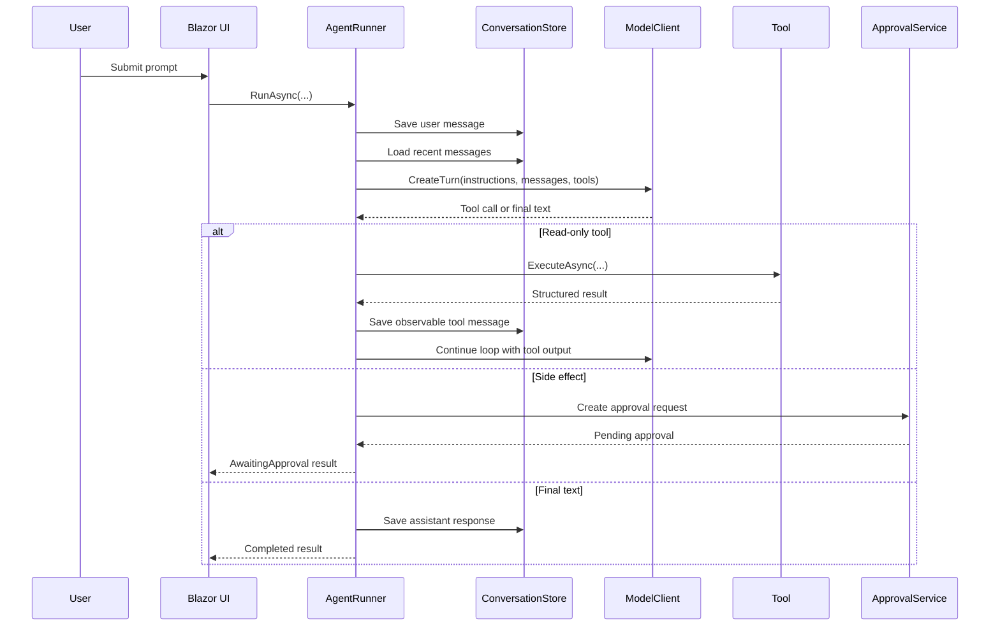

# Agent Loop

The sample keeps the control loop in `AgentRunner` so learners can see exactly how the agent advances from prompt to tool execution to final answer.

## Stages

1. Persist the incoming user message.
2. Start a new `AgentRun` with correlation and timing metadata.
3. Load the recent conversation window.
4. Build a `ModelTurnRequest` with:
   - the embedded prompt
   - recent user, assistant, and tool-result messages
   - registered tool schemas
5. Call the model client.
6. If the model returns tool calls:
   - verify the tool name is registered
   - validate JSON arguments
   - enforce the minimum role
   - request approval for side effects
   - execute read-only tools immediately
   - store the tool output as an observable message
7. Repeat until a final response, approval pause, failure, duplicate tool call, or maximum step limit is reached.

## Pseudocode

```text
persist(user message)
start run

for step in 1..MaximumSteps:
  messages = load recent conversation window
  modelResult = model.createTurn(instructions, messages, tools)

  if modelResult has final text and no tool calls:
    persist assistant final text
    persist step summary
    complete run as Completed
    return result

  for each tool call:
    stop if duplicate tool call fingerprint was seen before
    stop if tool is unknown
    stop if arguments fail validation
    stop if user is not authorized

    if tool requires approval:
      create approval request
      complete run as AwaitingApproval
      return result

    toolResult = execute tool
    persist tool execution
    persist tool output as observable conversation message

complete run as MaximumStepsExceeded
return result
```

## Sequence



## Guardrails in the loop

- maximum of eight steps per run
- duplicate tool-call detection
- server-side JSON validation
- authorization before execution
- approval pause before side effects
- no hidden reasoning persistence
