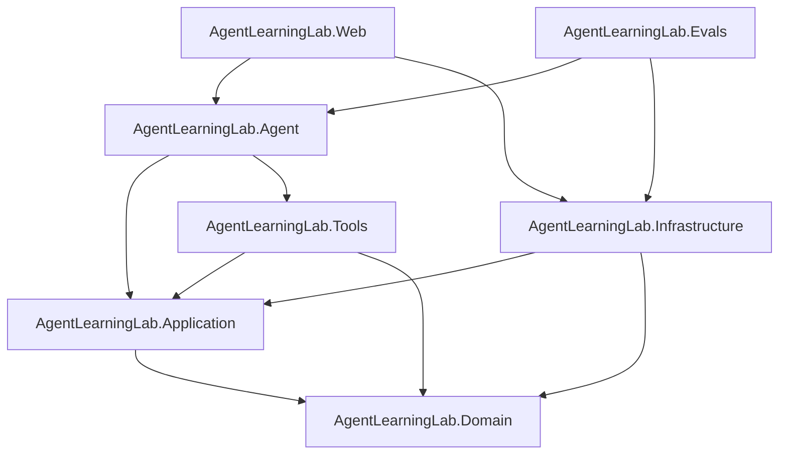

# Architecture

`AgentLearningLab` is a cleanly layered .NET 10 sample that keeps the agent loop explicit instead of hiding it behind a framework.

## Projects

- `AgentLearningLab.Domain`: core entities and enums such as `Aircraft`, `AgentRun`, `ApprovalRequest`, and `OutboxMessage`
- `AgentLearningLab.Application`: interfaces, options, tool abstractions, identity context, and UI-facing result models
- `AgentLearningLab.Infrastructure`: EF Core persistence, seeded data, retrieval, approvals, auditing, and stores
- `AgentLearningLab.Tools`: explicitly registered tools with schemas, validation, and authorization boundaries
- `AgentLearningLab.Agent`: prompt loading, fake and real model clients, tool registry, and the `AgentRunner`
- `AgentLearningLab.Web`: Blazor UI, health endpoint, and development-only identity switching
- `AgentLearningLab.Evals`: behavior-driven evaluation harness for offline and opt-in live runs

## Dependency direction

## Runtime flow

1. The Blazor page captures the user prompt and current development identity.
2. `AgentRunner` loads recent conversation messages from `IConversationStore`.
3. The runner sends instructions, recent observable messages, and whitelisted tool schemas to `IModelClient`.
4. Tool calls are validated, authorized, and either executed or converted into approval requests.
5. Tool outputs are persisted as observable conversation items and fed back into the loop.
6. The runner stores step summaries, tool executions, approval state, and final status in `IAgentRunStore`.
7. The UI renders only observable events: user messages, assistant messages, tool summaries, citations, approvals, and run traces.

## Why the layers matter

- The model client cannot reach the database directly.
- The UI never receives raw SDK objects.
- Tools are explicitly registered and schema-validated before execution.
- Side effects require both authorization and approval in application code.
- Tests can swap in `FakeModelClient` without changing the rest of the stack.
